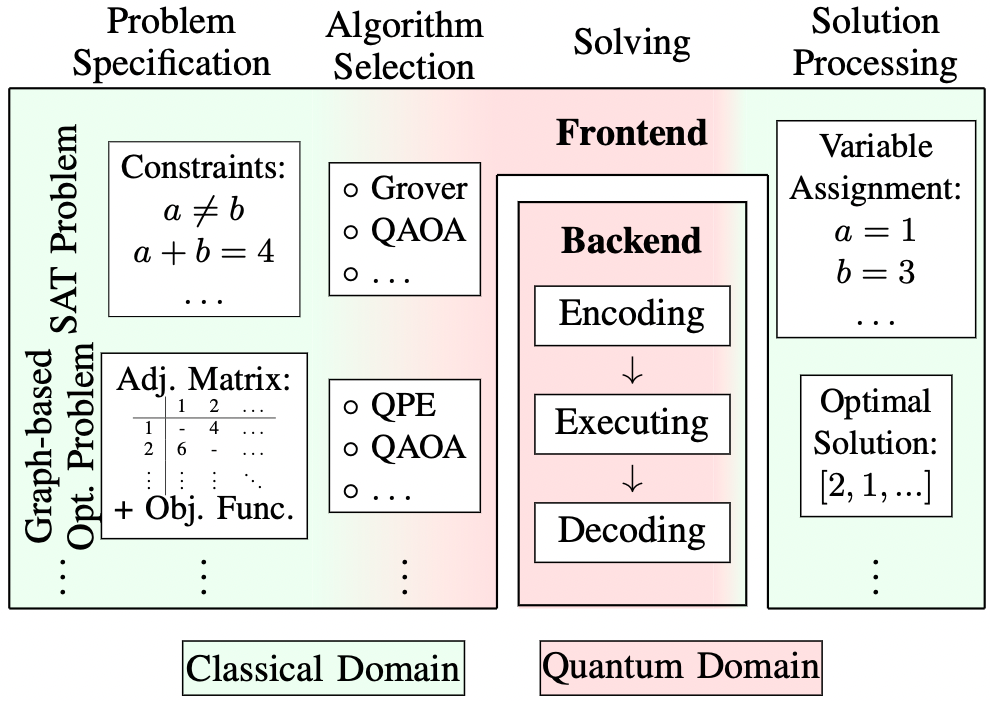
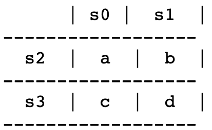

[](https://github.com/cda-tum/MQTProblemSolver/actions/workflows/linter.yml)
[](https://github.com/cda-tum/MQTProblemSolver/actions/workflows/coverage.yml)
[](https://github.com/cda-tum/MQTProblemSolver/actions/workflows/deploy.yml)

# MQT ProblemSolver

MQT ProblemSolver is a framework to utilize quantum computing as a technology for users with little to no
quantum computing knowledge.
All necessary quantum parts are embedded by domain experts while the interfaces provided are similar to the ones
classical solver provide:

<p align="center">

</p>

When provided with a problem description, MQT ProblemSolver offers a selection of implemented quantum algorithms.
The user just has to chose one and all further (quantum) calculation steps are encapsulated within MQT ProblemSolver.
After the calculation finished, the respective solution is returned - again in the same format as classical
solvers use.

In the current implementation, two case studies are conducted:

1. A SAT Problem: Constraint Satisfaction Problem
2. A Graph-based Optimization Problem: Travelling Salesman Problem

# A SAT Problem: Constraint Satisfaction Problem

This exemplary implementation can be found in the [CSP_example.ipynb](src/mqt/problemsolver/csp_example.ipynb) Jupyter notebook.
Here, the solution to a Kakuro riddle with a 2x2 grid can be solved for arbitrary sums `s0` to `s3`:

<p align="center">

</p>

MQT ProblemSolver will return valid values to `a`, `b`, `c`, and `d` if a solution exists.

# A Graph-based Optimization Problem: Travelling Salesman Problem

This exemplary implementation can be found in the [TSP_example.ipynb](src/mqt/problemsolver/tsp_example.ipynb) Jupyter notebook.
Here, the solution to a Travelling Salesman Problem with 4 cities can be solved for arbitrary distances `dist_1_2` to `dist_3_4`between the cities.

<p align="center">

</p>

MQT ProblemSolver will return the shortest path visiting all cities as a list.

# Repository Structure

```
.
├── src
│ └── mqt
│     └── problemsolver
│        └── csp.py
│        └── csp_example.ipynb
│        └── tsp.py
│        └── tsp_example.ipynb
└── tests
    └── ...
```
