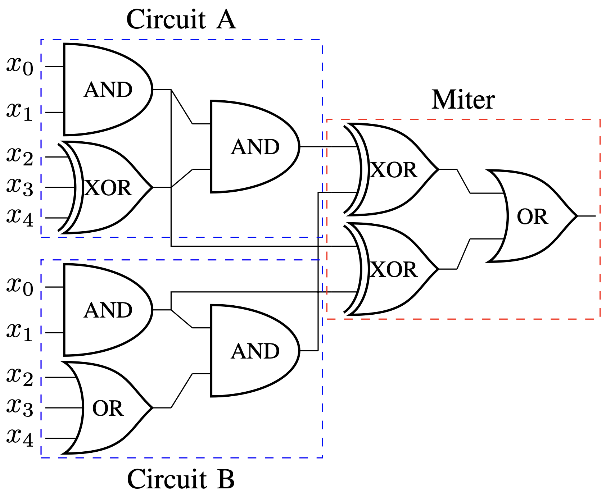
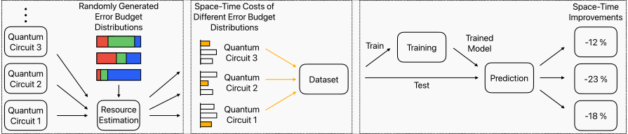

[](https://github.com/cda-tum/MQTProblemSolver/actions/workflows/coverage.yml)
[](https://github.com/cda-tum/MQTProblemSolver/actions/workflows/deploy.yml)

<p align="center">
  <a href="https://mqt.readthedocs.io">
   <picture>
     <source media="(prefers-color-scheme: dark)" srcset="https://raw.githubusercontent.com/munich-quantum-toolkit/.github/refs/heads/main/docs/_static/logo-mqt-dark.svg" width="60%">
     
   </picture>
  </a>
</p>

# MQT ProblemSolver

This repository covers the implementations of multiple research papers in the domain of quantum computing:

1. [Towards an Automated Framework for Realizing Quantum Computing Solutions](#towards-an-automated-framework-for-realizing-quantum-computing-solutions)
2. [A Hybrid Classical Quantum Computing Approach to the Satellite Mission Planning Problem](#a-hybrid-classical-quantum-computing-approach-to-the-satellite-mission-planning-problem)
3. [Reducing the Compilation Time of Quantum Circuits Using Pre-Compilation on the Gate Level](#reducing-the-compilation-time-of-quantum-circuits-using-pre-compilation-on-the-gate-level)
4. [Utilizing Resource Estimation for the Development of Quantum Computing Applications](#utilizing-resource-estimation-for-the-development-of-quantum-computing-applications)
5. [Towards Equivalence Checking of Classical Circuits Using Quantum Computing](#towards-equivalence-checking-of-classical-circuits-using-quantum-computing)
6. [Improving Hardware Requirements for Fault-Tolerant Quantum Computing by Optimizing Error Budget Distributions](#improving-hardware-requirements-for-fault-tolerant-quantum-computing-by-optimizing-error-budget-distributions)

In the following, each implementation is briefly introduced.

# Towards an Automated Framework for Realizing Quantum Computing Solutions

MQT ProblemSolver provides a framework to utilize quantum computing as a technology for users with little to no
quantum computing knowledge that is part of the Munich Quantum Toolkit (MQT) developed by the [Chair for Design Automation](https://www.cda.cit.tum.de/) at the [Technical University of Munich](https://www.tum.de/).
All necessary quantum parts are embedded by domain experts while the interfaces provided are similar to the ones
classical solver provide:

<p align="center">

</p>

When provided with a problem description, MQT ProblemSolver offers a selection of implemented quantum algorithms.
The user just has to choose one and all further (quantum) calculation steps are encapsulated within MQT ProblemSolver.
After the calculation finished, the respective solution is returned - again in the same format as classical
solvers use.

In the current implementation, two case studies are conducted:

1. A SAT Problem: Constraint Satisfaction Problem
2. A Graph-based Optimization Problem: Travelling Salesman Problem

## A SAT Problem: Constraint Satisfaction Problem

This exemplary implementation can be found in the [CSP_example.ipynb](notebooks/csp_example.ipynb) Jupyter notebook.
Here, the solution to a Kakuro riddle with a 2x2 grid can be solved for arbitrary sums `s0` to `s3`:

<p align="center">

</p>

MQT ProblemSolver will return valid values to `a`, `b`, `c`, and `d` if a solution exists.

## A Graph-based Optimization Problem: Travelling Salesman Problem

This exemplary implementation can be found in the [TSP_example.ipynb](notebooks/tsp_example.ipynb) Jupyter notebook.
Here, the solution to a Travelling Salesman Problem with 4 cities can be solved for arbitrary distances `dist_1_2` to `dist_3_4`between the cities.

<p align="center">

</p>

MQT ProblemSolver will return the shortest path visiting all cities as a list.

# A Hybrid Classical Quantum Computing Approach to the Satellite Mission Planning Problem

Additional to the two case studies, we provide a more complex example for the satellite mission planning problem.
The goal is to maximize the accumulated values of all images taken by the satellite while it is often not possible
to take all images since the satellite must rotate and adjust its optics.

In the following example, there are five to-be-captured locations which their assigned value.

<p align="center">

</p>

# Reducing the Compilation Time of Quantum Circuits Using Pre-Compilation on the Gate Level

Every quantum computing application must be encoded into a quantum circuit and then compiled for a specific device.
This lengthy compilation process is a key bottleneck and intensifies for recurring problems---each of which requires
a new compilation run thus far.

<p align="center">

</p>

Pre-compilation is a promising approach to overcome this bottleneck.
Beginning with a problem class and suitable quantum algorithm, a **predictive encoding** scheme is applied to encode a
representative problem instance into a general-purpose quantum circuit for that problem class.
Once the real problem instance is known, the previously constructed circuit only needs to be
**adjusted**—with (nearly) no compilation necessary:

<p align="center">

</p>
Following this approach, we provide a pre-compilation module that can be used to precompile QAOA circuits
for the MaxCut problem.

# Utilizing Resource Estimation for the Development of Quantum Computing Applications

Resource estimation is a promising alternative to actually execute quantum circuits on real quantum hardware which is
currently restricted by the number of qubits and the error rates. By estimating the resources needed for a quantum circuit,
the development of quantum computing applications can be accelerated without the need to wait for the availability of
large-enough quantum hardware.

In `resource_estimation/RE_experiments.py`, we evaluate the resources to calculate the ground state energy of a
Hamiltonian to chemical accuracy of 1 mHartree using the qubitization quantum simulation algorithm. The Hamiltonian
describes the 64 electron and 56 orbital active space of one of the stable intermediates in the ruthenium-catalyzed
carbon fixation cycle

In this evaluation, we investigate

- different qubit technologies,
- the impact of the maximal number of T factories,
- different design trade-offs, and
- hypothesis on how quantum hardware might improve and how it affects the required resources.

# Towards Equivalence Checking of Classical Circuits Using Quantum Computing

Equivalence checking, i.e., verifying whether two circuits realize the same functionality or not, is a typical task in the semiconductor industry. Due to the fact, that the designs grow faster than the ability to efficiently verify them, all alternative directions to close the resulting verification gap should be considered. In this work, we consider the problem through the miter structure. Here, two circuits to be checked are applied with the same primary inputs. Then, for each pair of to-be-equal output bits, an exclusive-OR (XOR) gate is applied-evaluating to 1 if the two outputs generate different values (which only happens in the case of non-equivalence). By OR-ing the outputs of all these XOR gates, eventually an indicator results that shows whether both circuits are equivalent. Then, the goal is to determine an input assignment so that this indicator evaluates to 1 (providing a counter example that shows non-equivalence) or to prove that no such assignment exists (proving equivalence).

<p align="center">

</p>

In the `equivalence_checking` module, our approach to this problem by utilizing quantum computing is implemented. There are two different ways to run this code.

- One to test, how well certain parameter combinations work. The parameters consist of the number of bits of the circuits to be verified, the threshold parameter delta (which is explained in detail in the paper), the fraction of input combinations that induce non-equivalence of the circuits (further called "counter examples"), the number of shots to run the quantum circuit for and the number of individual runs of the experiment. Multiple parameter combinations can be tested and exported as a .csv-file at a provided location.
- A second one to actually input a miter expression (in form of a string) together with some parameters independent from the miter (shots and delta) and use our approach to find the counter examples (if the circuits are non-equivalent).

These two implementations are provided by the functions `try_parameter_combinations()` and `find_counter_examples()`, respectively. Examples for their usages are shown in `notebooks/equivalence_checking/example.ipynb`.

# Improving Hardware Requirements for Fault-Tolerant Quantum Computing by Optimizing Error Budget Distributions

Applying error correction to execute quantum circuits fault-tolerantly induces massive overheads in the required physical resources, often in the orders of magnitude.
This leads to thousands of qubits already for toy-sized quantum applications. Obviously, these need to be reduced, for which the so-called error budget can be a particular lever.
Even though error correction is applied, a certain error rate still remains in the execution of the quantum circuit.
Hence, the end user defines a maximum tolerated error rate, the error budget, for the quantum application to be considered by the compiler.
Since an error-corrected quantum circuit consists of different parts, this error budget is distributed among these parts.
The way how it is distributed can have a significant effect on the resulting required resources.
To find an efficient distribution, we use resource estimation to evaluate different distributions as well as a machine learning model approach that automatically determines such efficient distributions for a given quantum circuit.

<p align="center">

</p>

The implementation of the approach can be found under `resource_estimation/error_budget_optimization`. An example usage of the implementation is shown in the `example_use.ipynb` notebook.

# Quantum Circuit Optimization for the Fault-Tolerance Era: Do We Have to Start from Scratch?

Translating quantum circuits into a device's native gate set often increases gate count, amplifying noise in today's error-prone Noisy Intermediate-Scale Quantum (NISQ) devices. Although optimizations exist to reduce gates, scaling to larger qubit and circuit sizes will see hardware errors dominate, blocking industrial-scale use. Error correction can enable Fault-Tolerant Quantum Computing (FTQC) but demands massive qubit overheads, often tens of thousands for small problems.

This motivates FTQC-oriented optimization techniques and raises the question: can NISQ techniques be adapted, or must new ones be developed? We address this question by evaluating Qiskit and TKET optimization passes on benchmark circuits from MQT Bench. As tools to directly design and evaluate fault-tolerant quantum circuit instances, we use resource estimation to assess FTQC requirements.

The implementation of the approach can be found under `resource_estimation/ft_optimization`.

# Usage

MQT ProblemSolver is available via [PyPI](https://pypi.org/project/mqt.problemsolver/):

```console
(venv) $ pip install mqt.problemsolver
```

# References

In case you are using MQT ProblemSolver in your work, we would be thankful if you referred to it by citing the following publication:

```bibtex
@INPROCEEDINGS{quetschlich2023mqtproblemsolver,
    title           = {{Towards an Automated Framework for Realizing Quantum Computing Solutions}},
    author          = {N. Quetschlich and L. Burgholzer and R. Wille},
    eprint          = {2210.14928},
    archivePrefix   = {arXiv},
    year            = {2023},
    booktitle       = {International Symposium on Multiple-Valued Logic (ISMVL)},
}
```

which is also available on arXiv:
[](https://arxiv.org/abs/2210.14928)

In case you are using our Satellite Mission Planning Problem approach, we would be thankful if you referred to it by citing the following publication:

```bibtex
@INPROCEEDINGS{quetschlich2023satellite,
    title           = {{A Hybrid Classical Quantum Computing Approach to the Satellite Mission Planning Problem}},
    author          = {N. Quetschlich and V. Koch and L. Burgholzer and R. Wille},
    eprint          = {2308.00029},
    archivePrefix   = {arXiv},
    year            = {2023},
    booktitle       = {IEEE International Conference on Quantum Computing and Engineering (QCE)},
}
```

which is also available on arXiv:
[](https://arxiv.org/abs/2308.00029)

In case you are using our Pre-Compilation approach, we would be thankful if you referred to it by citing the following publication:

```bibtex
@INPROCEEDINGS{quetschlich2023precompilation,
    title           = {{Reducing the Compilation Time of Quantum Circuits Using Pre-Compilation on the Gate Level}},
    author          = {N. Quetschlich and L. Burgholzer and R. Wille},
    eprint          = {2305.04941},
    archivePrefix   = {arXiv},
    year            = {2023},
    booktitle       = {IEEE International Conference on Quantum Computing and Engineering (QCE)},
}
```

which is also available on arXiv:
[](https://arxiv.org/abs/2305.04941)

In case you are using our Resources Estimation approach, we would be thankful if you referred to it by citing the following publication:

```bibtex
@misc{quetschlich2024resource_estimation,
    title           = {{Utilizing Resource Estimation for the Development of Quantum Computing Applications}},
    author          = {N. Quetschlich and M. Soeken and P. Murali and R. Wille},
    eprint          = {2402.12434},
    archivePrefix   = {arXiv},
    year            = {2024},
    booktitle       = {IEEE International Conference on Quantum Computing and Engineering (QCE)},
}
```

which is also available on arXiv:
[](https://arxiv.org/abs/2402.12434)

In case you are using our Equivalence-Checking approach, we would be thankful if you referred to it by citing the following publication:

```bibtex
@INPROCEEDINGS{quetschlich2024equivalence_checking,
    title           = {{Towards Equivalence Checking of Classical Circuits Using Quantum Computing}},
    author          = {N. Quetschlich and T. Forster and A. Osterwind and D. Helms and R. Wille},
    eprint          = {2408.14539},
    archivePrefix   = {arXiv},
    year            = {2024},
    booktitle       = {IEEE International Conference on Quantum Computing and Engineering (QCE)},
}
```

which is also available on arXiv:
[](https://arxiv.org/abs/2408.14539)

## Acknowledgements

This project received funding from the European Research Council (ERC) under the European Union's Horizon 2020 research
and innovation program (DA QC, grant agreement No. 101001318 and MILLENION, grant agreement No. 101114305), was part
of the Munich Quantum Valley, which is supported by the Bavarian state government with funds from the Hightech Agenda
Bayern Plus, and has been supported by the BMWK on the basis of a decision by the German Bundestag through project
QuaST, as well as by the BMK, BMDW, the State of Upper Austria in the frame of the COMET program, and the QuantumReady
project within Quantum Austria (managed by the FFG).

<p align="center">
<picture>
<source media="(prefers-color-scheme: dark)" srcset="https://raw.githubusercontent.com/cda-tum/mqt/main/docs/_static/tum_dark.svg" width="28%">

</picture>
<picture>

</picture>
<picture>
<source media="(prefers-color-scheme: dark)" srcset="https://raw.githubusercontent.com/cda-tum/mqt/main/docs/_static/erc_dark.svg" width="24%">

</picture>
<picture>

</picture>
</p>
